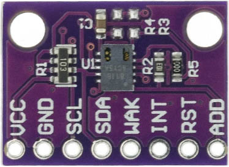

# Adafruit Feather HUZZAH ESP8266

Adafruit Feather HUZZAH ESP8266 (AFH) has an ESP8266 WiFi microcontroller, 3.3V logic and can be programming using the Arduino IDE.

## Pinout

Source: Adafruit.com

## DS18B20 Sensor

The DS18B20 is a temperature sensor that communicates over 1-Wire protocol.

Source: DS18B20 DataSheet

VDD - 3.3V

GND - GND

DQ  - AFH IO0 (4k7 resistor - 3.3V)

## DTH22 Sensor

The DHT22 is a temperature and humidity sensor where it outputs calibrated digital signal using exclusive collecting-technique.

(+) VDD - 3.3V

(-) GND - GND

Out  - AFH IO2

## BMP280 Sensor

The BMP280 is an environmental sensor of barometric pressure and it can be used in both I2C and SPI buses. Here, we use SPI bus.

 

VCC - 3.3V

GND - GND

SCL - SCK - AFH IO14

SDA - MOSI - AFH IO13

CSB - CSS - AFH IO16

SDO - MISO - AFH IO12

## CCS811 Sensor

The CCS811 is a gas sensor which detects a wide range of Volatile Organic Compounds (VOCs) for indoor air quality monitoring and it outputs an equivalent CO2 (eCO2) levels and TVOC values. It can be connected via I2C bus using one of its address (0x5A).

 

VCC - 3.3V

GND - GND

SCL - AFH IO5

SDA - AFH IO4

WAK - GND  --> Addr: 0x5A  

INT - (none)

RST - (none)

ADD - (none)

## MQ7 Sensor
MQ7 is a gas detection sensor, that specifically it is used for detection of carbon monoxide (CO) concentrations in the air. It outputs digital and analog signals.

 

VCC - 3.3V

GND - GND

D0 - (none)

A0 - AFH ADC (A0)  -- Warning!: this pin has a 1.0V maximum, a voltage divider 3.3V to 1.0V is need.

## BH1750 Sensor

The BH1750 is a sensor for luminous flux (lux) measurement. It can be connected via I2C bus using one of its address (0x23).

 

VCC - 3.3V

GND - GND

SCL - AFH IO5

SDA - AFH IO4

ADD - (none)  --> Addr: 0x23

 