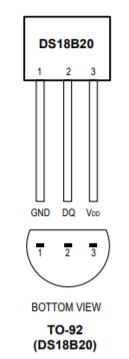
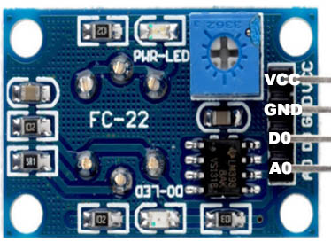
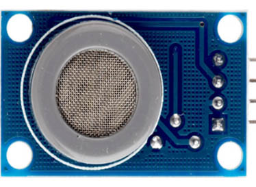

# Arduino Nano 33 BLE

The Arduino Nano 33 BLE (AN33BLE) is 3.3V compatible board with nRF52840 processor from Nordic Semiconductors, a 32-bit ARM® Cortex™-M4 CPU, and Bluetoth Low Energy (BLE) capacity.

## Pinout

Source: arduino.cc

## DS18B20 Sensor

The DS18B20 is a temperature sensor that communicates over 1-Wire protocol.

Source: DS18B20 DataSheet

VDD - 3.3V

GND - GND

DQ  - AN33BLE P1_11 (D2) (if you use only one sensor, you don't need  4k7 resistor)

## DTH22 Sensor

The DHT22 is a temperature and humidity sensor where it outputs calibrated digital signal using exclusive collecting-technique.

(+) VDD - 3.3V

(-) GND - GND

Out  - AN33BLE P1_15 (D4)

## BMP280 Sensor

The BMP280 is an environmental sensor of barometric pressure and it can be used in both I2C and SPI buses. Here, we use SPI bus.

 

VCC - 3.3V

GND - GND

SCL - SCK -  AN33BLE P0_13 (D13)

SDA - MOSI - AN33BLE P1_1 (D11)

CSB - CSS - AN33BLE P0_27 (D9)

SDO - MISO - AN33BLE P1_8 (D12)

## CCS811 Sensor

The CCS811 is a gas sensor which detects a wide range of Volatile Organic Compounds (VOCs) for indoor air quality monitoring and it outputs an equivalent CO2 (eCO2) levels and TVOC values. It can be connected via I2C bus using one of its address (0x5A).

 

VCC - 3.3V

GND - GND

SCL - AN33BLE P0_2 (A5)

SDA - AN33BLE P0_31 (A4)

WAK - GND  --> Addr: 0x5A  

INT - (none)

RST - (none)

ADD - (none)

## MQ7 Sensor
MQ7 is a gas detection sensor, that specifically it is used for detection of carbon monoxide (CO) concentrations in the air. It outputs digital and analog signals.

 

// A0

VCC - 3.3V

GND - GND

D0 - (none)

A0 - AN33BLE P0_4 (A0) 

## BH1750 Sensor

The BH1750 is a sensor for luminous flux (lux) measurement. It can be connected via I2C bus using one of its address (0x23).

 

VCC - 3.3V

GND - GND

SCL - AN33BLE P0_2 (A5)

SDA - AN33BLE P0_31 (A4)

ADD - (none)  --> Addr: 0x23

 
