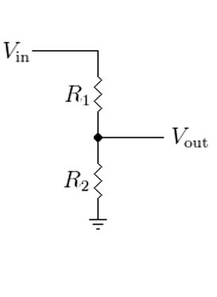

# BeagleBone Black Wireless

BeagleBone Black (BBB) Wireless is an open source board with a Sitara AM335x MPU 1GHz ARM® Cortex-A8 processor, 512MB DDR3 RAM, 4GB Embedded eMMC Flash with Debian Distribution and Wi-Fi (802.11b/g/n) and BLE  (Bluetooth 4.1) Connectivities.

## Pinout

Source: beagleboard.com

## DS18B20 Sensor

The DS18B20 is a temperature sensor that communicates over 1-Wire protocol.

Source: DS18B20 DataSheet

VDD - 3.3V

GND - GND

DQ  - BBB P9_12 (GPIO_60) (4k7 resistor - 3.3V)

## DTH22 Sensor

The DHT22 is a temperature and humidity sensor where it outputs calibrated digital signal using exclusive collecting-technique.

(+) VDD - 3.3V

(-) GND - GND

Out  - BBB P9_23 (GPIO_49)

## BMP280 Sensor

The BMP280 is an environmental sensor of barometric pressure and it can be used in both I2C and SPI buses. Here, we use SPI bus.

 

VCC - 3.3V

GND - GND

SCL - SCK - BBB P9_22 (SPI0_SLCK)

SDA - MOSI - BBB P9_18 (SPI0_D1)

CSB - CSS - BBB P9_21 (SPI0_D0)

SDO - MISO - BBB P9_22 (SPI0_SLCK)

## CCS811 Sensor

The CCS811 is a gas sensor which detects a wide range of Volatile Organic Compounds (VOCs) for indoor air quality monitoring and it outputs an equivalent CO2 (eCO2) levels and TVOC values. It can be connected via I2C bus using one of its address (0x5A).

 

VCC - 3.3V

GND - GND

SCL - BBB P9_19 (I2C2_SCL)

SDA - BBB P9_20 (I2C2_SDA)

WAK - GND  --> Addr: 0x5A  

INT - (none)

RST - (none)

ADD - (none)

## MQ7 Sensor
MQ7 is a gas detection sensor, that specifically it is used for detection of carbon monoxide (CO) concentrations in the air. It outputs digital and analog signals.

 

VCC - 3.3V

GND - GND

D0 - (none)

A0 - BBB P9_40 (AIN1)  -- Warning!: this pin has a 1.8V maximum, a voltage divider 3.3V to 1.8V is need.

## BH1750 Sensor

The BH1750 is a sensor for luminous flux (lux) measurement. It can be connected via I2C bus using one of its address (0x23).

 

VCC - 3.3V

GND - GND

SCL - BBB P9_19 (I2C2_SCL)

SDA - BBB P9_20 (I2C2_SDA)

ADD - (none)  --> Addr: 0x23

 
 
## Additional Components

### Voltage Divider 3.3V to 1.8V

A voltage divider is a circuit with resistors un series that translates an input voltage (Vin) to an output one (Vout). For example, with two resistors in series (R1 and R2) an input voltage (3.3V) can be translate to an output voltage (1.8V) where R1/R2 = 0.83.

´´´
R1 = 0.83 * R2
´´´

