# LattePanda 2G/32G

LattePanda 2G/32G (LP) is a Single Board Computer with an Intel Quad Core 1.8GHz processor, 2GB RAM and 32GB onboard flash memory. It has WiFi and Bluetooth 4.0 capacities, a built-in Arduino Leonardo (ATmega32u4) and it can run a full version of Windows 10.

## Pinout

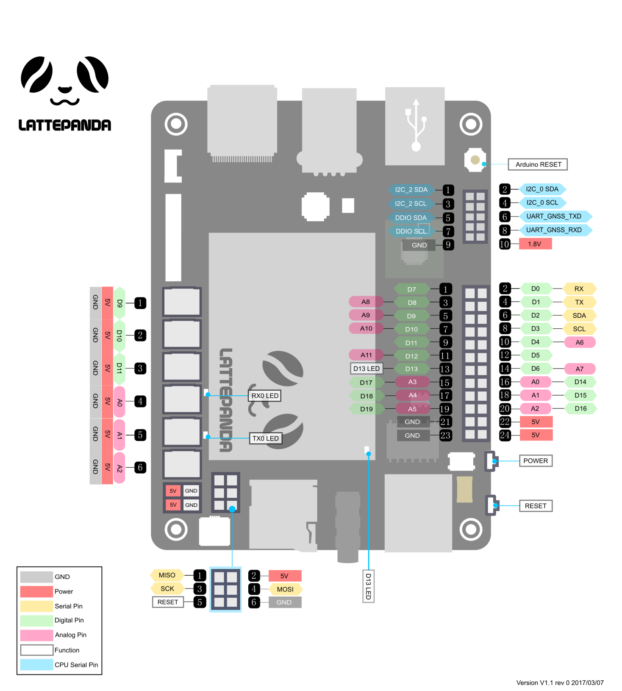

Source: lattepanda.com

## DS18B20 Sensor

The DS18B20 is a temperature sensor that communicates over 1-Wire protocol.

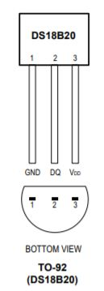

Source: DS18B20 DataSheet

VDD - 3.3V

GND - GND

DQ  - LP D5 (4k7 resistor - 3.3V)

## DTH22 Sensor

The DHT22 is a temperature and humidity sensor where it outputs calibrated digital signal using exclusive collecting-technique.

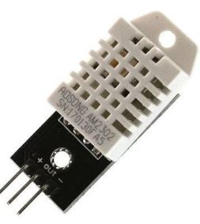

(+) VDD - 3.3V

(-) GND - GND

Out  - LP D12

## BMP280 Sensor

The BMP280 is an environmental sensor of barometric pressure and it can be used in both I2C and SPI buses. Here, we use SPI bus.

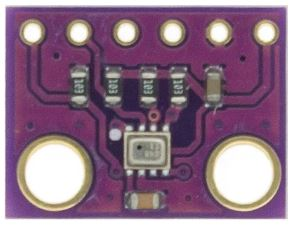 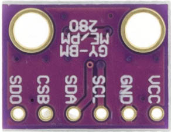

VCC - 3.3V

GND - GND

SCL - SCK - LP SCK

SDA - MOSI - LP MOSI

CSB - CSS - LP D7

SDO - MISO - LP MISO

## CCS811 Sensor

The CCS811 is a gas sensor which detects a wide range of Volatile Organic Compounds (VOCs) for indoor air quality monitoring and it outputs an equivalent CO2 (eCO2) levels and TVOC values. It can be connected via I2C bus using one of its address (0x5A).

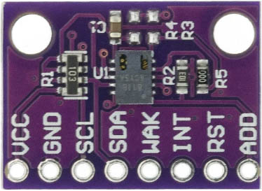 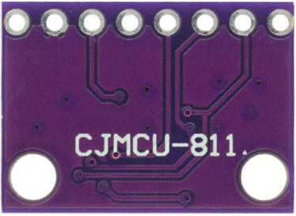

VCC - 3.3V

GND - GND

SCL - LP SCL (D3)

SDA - LP SDA (D2)

WAK - GND  --> Addr: 0x5A  

INT - (none)

RST - (none)

ADD - (none)

## MQ7 Sensor
MQ7 is a gas detection sensor, that specifically it is used for detection of carbon monoxide (CO) concentrations in the air. It outputs digital and analog signals.

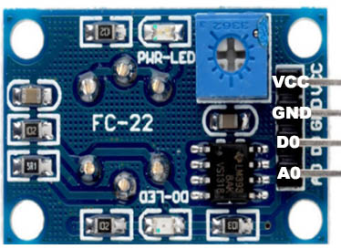 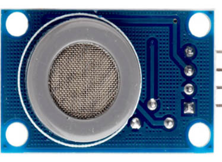

VCC - 3.3V

GND - GND

D0 - (none)

A0 - LP A0 (D14) 

## BH1750 Sensor

The BH1750 is a sensor for luminous flux (lux) measurement. It can be connected via I2C bus using one of its address (0x23).

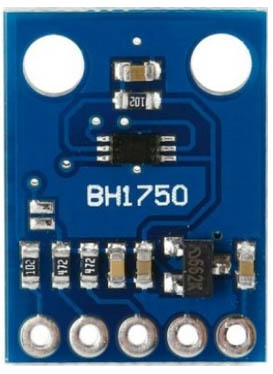 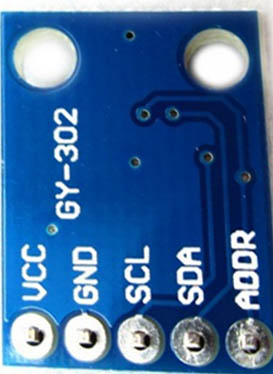

VCC - 3.3V

GND - GND

SCL - LP SCL (D3)

SDA - LP SDA (D2)

ADD - (none)  --> Addr: 0x23

 
 
## Additional Modules

### Level Shifter 5V to 3.3V

A level shifter is a module that translates signals from one logic voltage, for example 5V, to another, for example 3.3V, and vice versa.

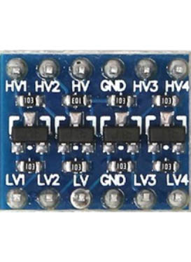

