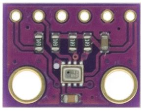
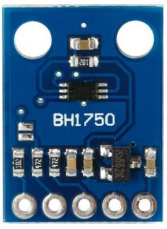
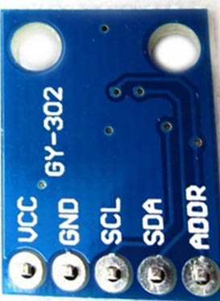

# Raspberry Pi 4 B

Raspberry Pi 4 B (RPi4B) is a Single Board Computer with an Broadcom BCM2711, Quad core Cortex-A72 (ARM v8) 64-bit, 4GB RAM and WiFi and BLE (Bluetooth 5.0) capacities. It can run Raspberry Pi OS (Linux OS derivative).

## Pinout

Source: raspberrypi.org

## DS18B20 Sensor

The DS18B20 is a temperature sensor that communicates over 1-Wire protocol.

Source: DS18B20 DataSheet

VDD - 3.3V

GND - GND

DQ  - RPi4B GPIO4  (4k7 resistor - 3.3V)

## DTH22 Sensor

The DHT22 is a temperature and humidity sensor where it outputs calibrated digital signal using exclusive collecting-technique.

(+) VDD - 3.3V

(-) GND - GND

Out  - RPi4B GPIO26

## BMP280 Sensor

The BMP280 is an environmental sensor of barometric pressure and it can be used in both I2C and SPI buses. Here, we use SPI bus.

 

VCC - 3.3V

GND - GND

SCL - SCK - RPi4B SCLK GPIO11 (SPI0)

SDA - MOSI - RPi4B MOSI GPIO10 (SPI0)

CSB - CSS - RPi4B GPIO25

SDO - MISO - RPi4B MISO GPIO9 (SPI0)

## CCS811 Sensor

The CCS811 is a gas sensor which detects a wide range of Volatile Organic Compounds (VOCs) for indoor air quality monitoring and it outputs an equivalent CO2 (eCO2) levels and TVOC values. It can be connected via I2C bus using one of its address (0x5A).

 

VCC - 3.3V

GND - GND

SCL - RPi4B Serial Clock GPIO3 (I2C)

SDA - RPi4B Serial Data GPIO2 (I2C)

WAK - GND  --> Addr: 0x5A  

INT - (none)

RST - (none)

ADD - (none)

## MQ7 Sensor
MQ7 is a gas detection sensor, that specifically it is used for detection of carbon monoxide (CO) concentrations in the air. It outputs digital and analog signals.

 

VCC - 3.3V

GND - GND

D0 - (none)

A0 -  ADS.P0  - (I2C: ADS.SCL - GPIO3. ADS.SDA - GPIO2) -- ADS1115 (ADS) Analog-Digital converter is need.

## BH1750 Sensor

The BH1750 is a sensor for luminous flux (lux) measurement. It can be connected via I2C bus using one of its address (0x23).

 

VCC - 3.3V

GND - GND

SCL - RPi4B Serial Clock GPIO3 (I2C)

SDA - RPi4B Serial Data GPIO2 (I2C)

ADD - (none)   -->  Addr: 0x23

 

