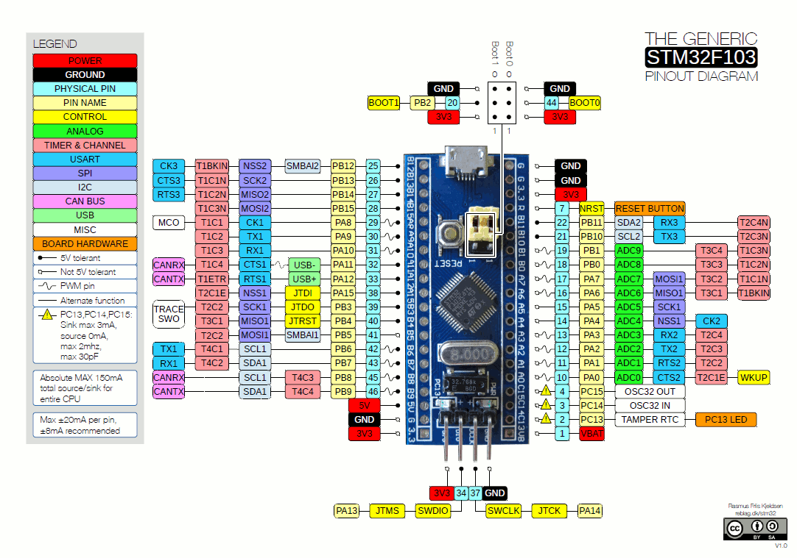
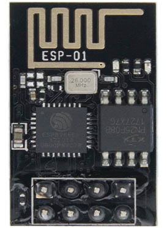
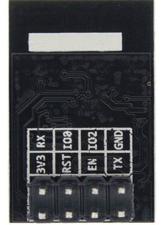
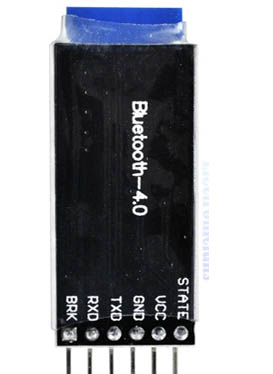
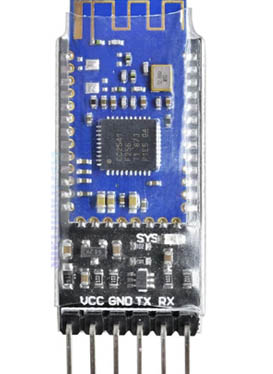
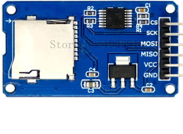
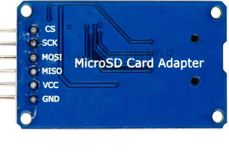

# STM32F103C8T6

STM32F103C8T6 (STM32) is a single-board with a Arm Cortex-M3 microcontroller manufactured by ST-Microelectronics, 64 Kb of Flash and 20 Kb of SRAM, 15 PWM Pins, 10 Analog Channels of 12-bit ADC, 2 I2C, 3 USART and 2 SPI buses.

## Pinout

Source: stm32duinoforum.com

## DS18B20 Sensor

The DS18B20 is a temperature sensor that communicates over 1-Wire protocol.

Source: DS18B20 DataSheet

VDD - 3.3V

GND - GND

DQ  - STM32 PA0 (4k7 resistor - 3.3V)

## DTH22 Sensor

The DHT22 is a temperature and humidity sensor where it outputs calibrated digital signal using exclusive collecting-technique.

(+) VDD - 3.3V

(-) GND - GND

Out  - STM32 PA1

## BMP280 Sensor

The BMP280 is an environmental sensor of barometric pressure and it can be used in both I2C and SPI buses. Here, we use SPI bus.

 
VCC - 3.3V

GND - GND

SCL - SCK - STM32 PB13 (SCK2)

SDA - MOSI - STM32 PB15 (MOSI2)

CSB - CSS - STM32 PB12 (NSS2)

SDO - MISO - STM32 PB14 (MISO2)

## CCS811 Sensor

The CCS811 is a gas sensor which detects a wide range of Volatile Organic Compounds (VOCs) for indoor air quality monitoring and it outputs an equivalent CO2 (eCO2) levels and TVOC values. It can be connected via I2C bus using one of its address (0x5A).

 

VCC - 3.3V

GND - GND

SCL - STM32 PB6

SDA - STM32 PB7

WAK - GND  --> Addr: 0x5A  

INT - (none)

RST - (none)

ADD - (none)

## MQ7 Sensor
MQ7 is a gas detection sensor, that specifically it is used for detection of carbon monoxide (CO) concentrations in the air. It outputs digital and analog signals.

 

VCC - 3.3V

GND - GND

D0 - (none)

A0 - STM32 PB1

## BH1750 Sensor

The BH1750 is a sensor for luminous flux (lux) measurement. It can be connected via I2C bus using one of its address (0x23).

 

VCC - 3.3V

GND - GND

SCL - STM32 PB6

SDA - STM32 PB7

ADD - (none)  --> Addr: 0x23

 
## Additional Modules

### ESP01 Wi-Fi

The ESP-01 module integrates an ESP8266 SoC with Wi-Fi capacity that allows SBA access to a Wi-Fi network via Serial port.

 

VCC - 3.3V

GND - GND

TX - STM32 PA3 (RX2)

RX - STM32 PA2 (TX2)

RST - (none)

EN - 3.3V

IO0 - (none)

IO2 - (none)

### HM10 Bluetooth 4.0 (BLE)

The HM-10 is a Bluetooth Low Energy (BLE, Bluetooth 4.0) module based on the CC2541 chip from Texas Instruments. This module provides to SBA the BLE capability via Serial port.

 

VCC - 3.3V

GND - GND

TX - STM32 PB11 (RX3)

RX - STM32 PB10 (TX3)

STATE - (none)

BRK - (none)

### microSD Adapter

 

VCC - 3.3V

GND - GND

SCK - STM32 PB3 (SCK1)

MOSI - STM32 PB5 (MOSI1)

CS - STM32 PA15 (NSS1)

MISO - STM32 PB4 (MISO1)