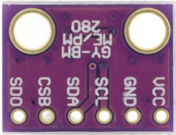
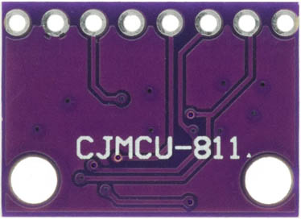

# STM32F103C8T6

STM32F103C8T6 (STM32) is a single-board with a Arm Cortex-M3 microcontroller manufactured by ST-Microelectronics, 64 Kb of Flash and 20 Kb of SRAM, 15 PWM Pins, 10 Analog Channels of 12-bit ADC, 2 I2C, 3 USART and 2 SPI buses.

## DS18B20 Sensor

The DS18B20 is a temperature sensor that communicates over 1-Wire protocol.

Source: DS18B20 DataSheet

VDD - 3.3V

GND - GND

DQ  - STM32 PA0 (4k7 resistor - 3.3V)

## DTH22 Sensor

The DHT22 is a temperature and humidity sensor where it outputs calibrated digital signal using exclusive collecting-technique.

(+) VDD - 3.3V

(-) GND - GND

Out  - STM32 PA1

## BMP280 Sensor

The BMP280 is an environmental sensor of barometric pressure and it can be used in both I2C and SPI buses. Here, we use SPI bus.

 

VCC - 3.3V

GND - GND

SCL - SCK - STM32 PB13

SDA - MOSI - STM32 PB15

CSB - CSS - STM32 PB12

SDO - MISO - STM32 PB14

## CCS811 Sensor

The CCS811 is a gas sensor which detects a wide range of Volatile Organic Compounds (VOCs) for indoor air quality monitoring and it outputs an equivalent CO2 (eCO2) levels and TVOC values. It can be connected via I2C bus using one of its address (0x5A).

 

VCC - 3.3V

GND - GND

SCL - STM32 PB6

SDA - STM32 PB7

WAK - GND  --> Addr: 0x5A  

INT - (none)

RST - (none)

ADD - (none)

## MQ7 Sensor
MQ7 is a gas detection sensor, that specifically it is used for detection of carbon monoxide (CO) concentrations in the air. It outputs digital and analog signals.

 

VCC - 3.3V

GND - GND

D0 - (none)

A0 - STM32 PB1

## BH1750 Sensor

The BH1750 is a sensor for luminous flux (lux) measurement. It can be connected via I2C bus using one of its address (0x23).

 

VCC - 3.3V

GND - GND

SCL - STM32 PB6

SDA - STM32 PB7

ADD - (none)  --> Addr: 0x23

 
